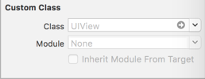
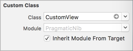

### Custom UIView's constructed using Nib's in Swift - the pragmatic way

### Problems

##### Problem #1: Exposing the internal implementation

Assuming that `CustomView` uses a Nib file to create the visual elements of it's user interface, the most common way of instantiating a new instance of this class is as follows:

> Swift

```swift
let nib = UINib(nibName: "CustomView", bundle: nil)
let v = nib.instantiate(withOwner: nil, options: nil).first as! CustomView
v.frame = CGRect.init(x:0, y:0, width:320, height:50)
v.backgroundColor = UIColor.green
v.nameLabel.text = "Happy"
v.valueLabel.text = "Holidays"
self.view.addSubview(v)
```

The Nib is an implementation detail of `CustomView`, and as such shouldn't be exposed to the caller. If the developer of `CustomView` were to change from using Interface Builder to create the visual elements, to constructing the visual elements programmatically inside `init` or `init(frame:)`, then the calling code would also need to change as follows:

> Swift

```swift
let v = CustomView(frame: CGRect.init(x:0, y:0, width:320, height:50)
v.backgroundColor = UIColor.green
v.nameLabel.text = "Happy"
v.valueLabel.text = "Holidays"
self.view.addSubview(v)
```

##### Problem #2: Nested view hierarchy

To hide the Nib construction implementation detail from calling code, most solutions (Stack Overflow, Medium, Ray Wenderlich etc) suggest the following pattern:

> Swift

```swift
class CustomView: UIView {
  
  var contentView: UIView!
  
  required init?(coder aDecoder: NSCoder) {
    super.init(coder: aDecoder)
    loadNib()
  }

  override init(frame: CGRect) {
    super.init(frame: frame)
    loadNib()
  }

  func loadNib() {
    let nib = UINib(nibName: "CustomView", bundle: nil)
    contentView = nib.instantiateWithOwner(self, options: nil)[0] as! UIView
    contentView = self.bounds
    contentView = [UIViewAutoresizing.FlexibleWidth, UIViewAutoresizing.FlexibleHeight]
    addSubview(contentView)
  }
}
```

The `CustomView` Interface Builder file that was used to create the visual elements has to be of type `UIView`, rather than a Custom Class of `CustomView`. 



The Nib instantied `UIView` is then added as a subview of `CustomView`, leading to a nested `UIView` hierarchy, and all the problems that it entails.

### Solutions

##### Objective-C to the rescue

Objective-C has long been able to solve both problems by allowing the `CustomView` subclass to instantiate it's visual elements using `UINib` inside the initializer and assigning the resulting `CustomView` to `self` as follows:

> Objective-C

```objective-c
- (instancetype) initWithFrame: (CGRect) frame {
    self = [[[NSBundle mainBundle] loadNibNamed: @"CustomView" owner: nil options: nil] objectAtIndex: 0];
    if (self) {
        self.frame = frame;
    }
    return self;
}
```
This solves both problem #1 (exposing the internal implementation) and #2 (nested view hierarchy)

The same code cannot be acheived in Swift as you cannot assign to `self` in a Class initializer. You cannot for instance do the following:

> Swift

```swift
public override convenience init(frame: CGRect) {
  self = Bundle.main.loadNibNamed("CustomView", owner:nil, options:nil)![0] as! Self;
  self.frame = frame
}
```

This will result in compilation errors.

##### Swift Solution - Protocol Extensions

The solution for Swift is to use protocol extensions. Initializers declared in protocol extensions are the only initializers allowed to assign to `self`.

> Swift

```swift
fileprivate protocol _CustomView {
}

extension CustomView: _CustomView {
}

fileprivate extension _CustomView {

    init(internal: Int?) {
        self = Bundle.main.loadNibNamed("CustomView", owner:nil, options:nil)![0] as! Self;
    }
}
```

##### Example

The `PragmaticNib` project demonstrates both Objective-C `CustomObjCView` and Swift `CustomView` versions of loading Nibs from a bundle and assigning to `self`. The `CustomView` Interface Builder file that was used to create the visual elements has a Custom Class of `CustomView`.



All code developed in Xcode 9.2 with SDK11, Swift 4 - the solution should also work with earlier versions of Xcode and Swift.
